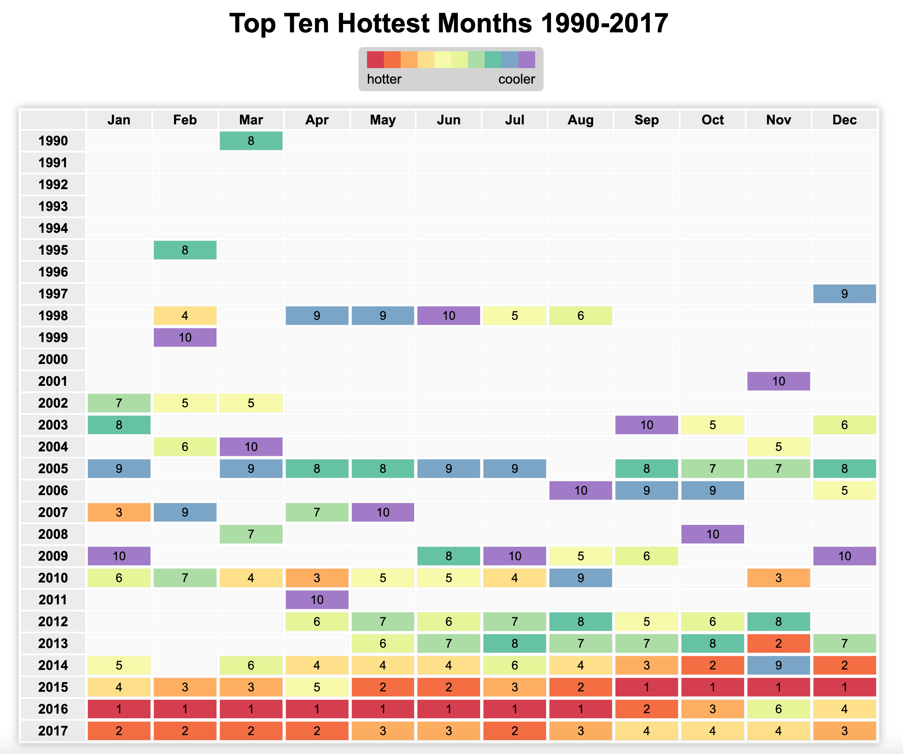

# climate-change-dataviz-js
Visualize trends in Temperature Data with HTML, CSS and Javascript

This project was inspired by this course [How to Visualize Data with JavaScript
](https://www.udemy.com/course/how-to-visualize-data-with-javascript).

I avoid using the `jQuery` library and just use vanilla Javascript.

See this project live [here](https://juanjoc333.github.io/climate-change-dataviz-js/).

## Data Source
[NOAA Global Time Series 1990-2017](https://www.ncei.noaa.gov/access/monitoring/climate-at-a-glance/global/time-series/globe/land_ocean/all/12/1990-2017)
